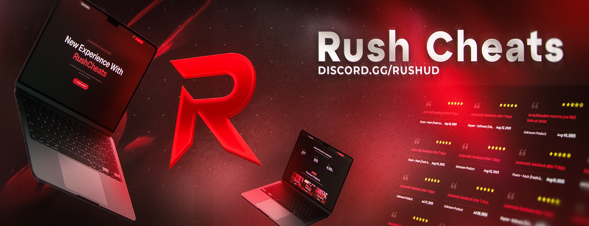

# 🚀 RushMenu

**Un menu de triche simple et puissant pour Among Us avec une interface intuitive et de nombreuses fonctionnalités.**

---

## 🎁 Releases

| Mod Version | Among Us - Version | Link |
|-------------|--------------------|----|
| v3.0.1 | 2026.2.17 (17.0.0) | [Download](../../releases/tag/v3.0.1) |

---

## 📥 Installation

1. **Téléchargez** la dernière version depuis le tableau [Releases](#-releases) ci-dessus
2. **Extrayez** le fichier ZIP téléchargé
3. **Localisez** votre dossier Among Us (généralement `Steam\steamapps\common\Among Us`)
4. **Copiez** tout le contenu extrait dans le dossier du jeu :
   - `winhttp.dll`
   - `doorstop_config.ini`
   - Dossiers `BepInEx` et `dotnet` complets
5. **Vérifiez** que `RushMenu.dll` se trouve dans `BepInEx\plugins\`
6. **Lancez** le jeu et appuyez sur **Suppr** (Delete) pour ouvrir le menu

> ⚠️ **Important** : Nécessite BepInEx 6.0.0-BE-735 minimum

---

## ⚙️ Configuration

Après le premier lancement, éditez `BepInEx\config\RushMenu.cfg` pour personnaliser :

| Paramètre | Description | Valeur par défaut |
|-----------|-------------|-------------------|
| **GUI.Keybind** | Touche pour ouvrir/fermer le menu | `Delete` |
| **GUI.Color** | Couleur du menu (code HTML) | - |
| **GuestMode.GuestMode** | Génère un compte invité à chaque lancement (contourne les bans) | `false` |
| **GuestMode.FriendName** | Nom d'ami pour le mode invité (≤10 caractères, pas de #) | - |
| **Spoofing.Level** | Niveau personnalisé affiché aux autres (0-4294967295) | - |
| **Spoofing.Platform** | Plateforme affichée aux autres | - |
| **Privacy.HideDeviceId** | Masque votre ID unique (potentiellement anti-ban matériel) | `true` |
| **Privacy.NoTelemetry** | Désactive l'envoi de statistiques à Innersloth | `true` |

---

## 🎯 Fonctionnalités

### 👱 Joueur

#### Déplacement
- **NoClip** : Traversez les murs comme un fantôme
- **Boost Speed** : Double votre vitesse de déplacement
- **Téléportation au Curseur** : Clic droit pour vous téléporter
- **Téléportation vers Joueur** : Sélectionnez un joueur cible

#### Actions mortelles
- **Kill Player** : Tuez un joueur spécifique instantanément
- **Kill All Crewmates** : Élimine tous les crewmates
- **Kill All Impostors** : Élimine tous les imposteurs
- **Kill All** : Élimine tous les joueurs

---

### 👁️ ESP (Extra Sensory Perception)

#### Vision
- **See Roles** : Voir le rôle de chaque joueur sur leur pseudo
- **See Ghosts** : Voir les fantômes et leur chat même vivant
- **No Shadows** : Supprime les ombres (vision durant blackout + à travers les murs)
- **Reveal Votes** : Voir les votes en temps réel (même anonymes)
- **Always Chat** : Chat toujours disponible (hors réunion/lobby)

#### Caméra
- **Zoom Out** : Dézoom avec la molette de la souris
- **Spectate** : Suivez la caméra d'un autre joueur
- **Freecam** : Déplacez la caméra librement sans bouger votre personnage

#### Tracers
Lignes pointant vers :
- **Crewmates** (cyan)
- **Impostors** (rouge)
- **Ghosts** (blanc)
- **Dead Bodies** (jaune)
- **Color-based** : Utilise la couleur du joueur

#### Minimap
Points sur la carte pour :
- **Crewmates** (cyan)
- **Impostors** (rouge)
- **Ghosts** (blanc)
- **Color-based** : Utilise la couleur du joueur

---

### 🎭 Rôles

#### Général
- **Set Fake Role** : Changez votre rôle (tous les rôles disponibles)
  - Shapeshifter et Phantom désactivés par défaut (anti-anticheat)

#### Imposteur
- **Kill Anyone** : Tuez n'importe qui (protégé, imposteur, fantôme, dans un conduit)
- **No Kill Cooldown** : Tuez sans cooldown
- **Kill Reach** : Tuez à distance infinie

#### Phantom
- **Kill While Vanished** : Tuez en étant invisible

#### Shapeshifter
- **No Ss Animation** : Transformation instantanée
- **Endless Ss Duration** : Reste transformé indéfiniment

#### Crewmate
- **Complete My Tasks** : Termine toutes vos tâches instantanément

#### Tracker
- **Endless Tracking** : Suivez un joueur indéfiniment
- **No Track Delay** : Supprime le délai de tracking
- **No Track Cooldown** : Pas de cooldown entre les tracks

#### Engineer
- **Endless Vent Time** : Reste dans les conduits indéfiniment
- **No Vent Cooldown** : Pas de cooldown entre les conduits

#### Scientist
- **Endless Battery** : Batterie infinie sur les vitals
- **No Vitals Cooldown** : Pas de cooldown sur les vitals

---

### 🚀 Vaisseau

#### Général
- **Unfixable Lights** : Lumières éteintes définitivement (réactivable)
- **Report Body** : Signale n'importe quel joueur comme corps
- **Close Meeting** : Ferme la réunion (uniquement pour vous)

#### Sabotages
Fonctionnent même sans être imposteur, sans cooldown, simultanément, et durant les réunions :
- **Reactor** : Active/désactive le sabotage réacteur
- **Oxygen** : Active/désactive le sabotage oxygène
- **Lights** : Active/désactive le sabotage lumières
- **Comms** : Active/désactive le sabotage communications
- **Doors** : Verrouille toutes les portes instantanément
- **MushroomMixup** : Sabotage champignons (carte Fungle)

#### Conduits
- **UseVents** : Utilisez les conduits sans être imposteur/engineer
- **KickVents** : Éjecte tous les joueurs des conduits
- **WalkInVents** : Invisibilité en restant dans un conduit tout en bougeant

---

### 💤 Passifs

**Toujours actifs par défaut (ne peuvent pas être désactivés pour éviter les problèmes)**

- **Free Cosmetics** : Accès à tous les cosmétiques gratuits
  - Chapeaux, visières, skins, animaux, plaques, bundles, cosmicubes
- **Avoid Penalties** : Supprime les pénalités de déconnexion
- **Unlock Extra Features** : Débloque automatiquement
  - Chat libre, liste d'amis, nom personnalisé, jeu en ligne

---

## 🛠️ Informations techniques

- **Auteur** : Root
- **Version** : 3.0.1
- **Framework** : BepInEx 6.0.0-BE-735 (Unity IL2CPP)
- **Langage** : C# (.NET 6.0)
- **Bibliothèques** : HarmonyLib pour le patching

---

## ⚠️ Avertissement

Ce mod n'est **pas affilié** à Among Us ou Innersloth LLC.

L'utilisation de ce mod peut **violer les conditions d'utilisation** d'Among Us et entraîner des sanctions, y compris des **bannissements temporaires ou permanents**.

L'auteur n'est **pas responsable** des conséquences de l'utilisation de ce mod.

**Utilisez à vos propres risques.**

---

**Rejoignez-nous sur Discord : [discord.gg/RUSHUD](https://discord.gg/RUSHUD)**

Made with 💀 by Slayy

